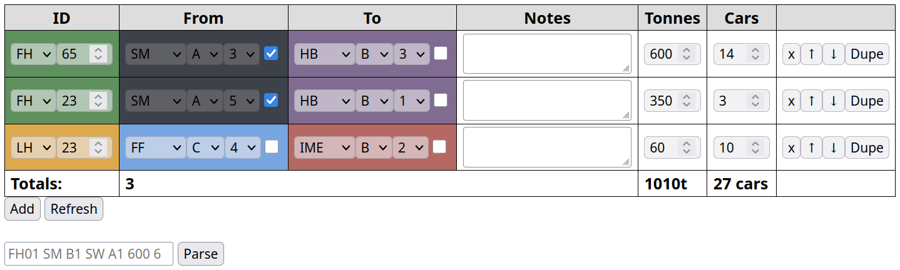

# Derail Valley Order Tracker

A web app powered by Rust and HTMX to aid in keeping track of orders in [Derail Valley](https://www.derailvalley.com/) (DV).

## Features

I use this in DV all the time, so I wanted to make sure that it did all order management so I could focus on planning the route rather than flipping through order booklets.

1. Add orders (type, ID, From/To, Notes, Tonnes, Cars)
2. Move and duplicate orders
3. Check-off load and unloads
4. Parse orders using string format (e.g.: `FH01 SM B1 SW A1 600 6`)
5. Inherently multiplayer. Refresh to view updates.

## Getting Started

### Installation

You will need [Rust](https://rust-lang.org) installed, which works on Windows, macOS, and Linux.

Then, run `cargo run` to build and start the server. Optionally, you can pass in an address to bind to, such as `cargo run -- --address 0.0.0.0:3000`.

Then, open your browser to `http://localhost:3000` to view the app.

### Usage

1. Add orders by clicking the "Add" button.

2. Move and duplicate orders by using the options on the right of each order.

3. Check off loads and unloads by clicking the checkbox on the right of each location (From and To).

4. Enter orders manually by entering the order string into the input field and clicking the "Parse" button.

### Order Format (Manual Entry)

I made a simple format for entering orders using text, instead of clicking through the UI.

The format is: `<kind><id> <from station> <from yard/track> <to station> <to yard/track> [tonnes] [cars]`.

Examples:

- `FH01 SM B1 SW A1 600 6`
- `LH02 CM A1 CS B1 400 4`
- `SL03 FM A1 HB B1 200`
- `SU04 FF A1 CME B1`

_Note: The syntax is **very** strict, so make sure to follow it exactly._
